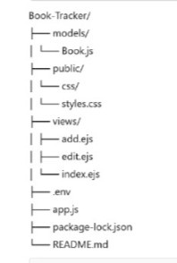

# 📚 Book Tracker

A simple web application to track your books, add notes, and manage your personal reading list. Built using **Node.js**, **Express**, **EJS**, and **MongoDB**.

---

## 🚀 Features
- Add a new book with title, author, genre, and read status.
- View a list of all added books.
- Edit or delete existing book entries.
- Filter books by genre or status.
- User-friendly EJS-powered views.

---

## 📂 Project Structure

---

## Demo-Video

⚙️ How to Run the Project

1️⃣ Clone the Repository

git clone https://github.com/KarriPurnima/Book-Tracker.git

cd Book-Tracker

2️⃣ Install Dependencies

npm install

3️⃣ Set Up Environment Variables
Create a .env file in the root directory and add your MongoDB connection string:

MONGO_URI=your_mongodb_connection_string

PORT=3000

4️⃣ Run the Application

node app.js

Then, open your browser and visit:

http://localhost:3000

📌 Tech Stack:
Node.js
Express
MongoDB
EJS
CSS

✨ Author

Karri Purnima
https://github.com/KarriPurnima

📄 License

This project is open-source and available under the MIT License.
